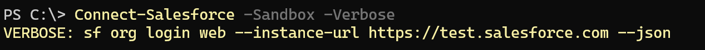

[](https://github.com/tonygward/psfdx/actions/workflows/ci.yml)
PowerShell modules that wraps the Salesforce CLI.

## Modules
| Module | Description |
| :--- | :--- |
| `psfdx` | Core cmdlets for authentication, record operations, org management, and utilities. |
| `psfdx-development` | Helpers for Salesforce DX development workflows (projects, scratch orgs, tests, deploy). |
| `psfdx-logs` | Tools for working with Salesforce Apex logs. |
| `psfdx-metadata` | Commands for retrieving, deploying, and describing Salesforce metadata. |
| `psfdx-packages` | Helpers for managing Salesforce packages: list, create, version, promote, install. |
# Pre-Requisites
You must install Salesforce SFDX
https://developer.salesforce.com/tools/sfdxcli

# Installation

### Linux
```
git clone https://github.com/tonygward/psfdx
cd psfdx
./install-linux.ps1
```

### Windows
```
git clone https://github.com/tonygward/psfdx
cd psfdx
./install-windows.ps1
```

# Examples
**1. Connect to a Salesforce Sandbox Org**
```
Import-Module psfdx
Connect-Salesforce -Sandbox
```
A web browser will appear, login to Salesforce as you would normally.

**-Verbose** switch reveals the underlying Salesfore CLI


**2. Retrieve first 10 Salesforce Accounts**
```
Import-Module psfdx
Select-SalesforceRecords -Query "SELECT Id,Name FROM Account LIMIT 10" -TargetOrg my@email.com
```
NB you only need to Import-Module psfdx once per PowerShell session

**3. Create and use a Salesforce Alias**
```
Add-SalesforceAlias -TargetOrg my@email.com -Alias myalias
Select-SalesforceRecords -Query "SELECT Id,Name FROM Account LIMIT 10" -TargetOrg myalias
```

**4. Retrieve every psfdx cmdlet**
```
Get-Command -Module psfdx
```

## Cmdlets by Module

### psfdx

`Import-Module psfdx`

| Category | Cmdlet | Description |
| :--- | :--- | :--- |
| Authentication & Orgs | `Connect-Salesforce` | Web-based org authentication. |
|  | `Disconnect-Salesforce` | Logout from orgs. |
|  | `Connect-SalesforceJwt` | JWT-based authentication. |
|  | `Open-Salesforce` | Open org in a browser or get URL. |
|  | `Get-SalesforceConnections` | List connected orgs (non-scratch by default). |
|  | `Repair-SalesforceConnections` | Clean up stale connections. |
| Aliases | `Get-SalesforceAlias` | List configured aliases. |
|  | `Add-SalesforceAlias` | Create/update an alias. |
|  | `Remove-SalesforceAlias` | Remove an alias. |
| Limits & Usage | `Get-SalesforceLimits` | Retrieve org limits (API, storage, etc.). |
|  | `Get-SalesforceDataStorage` | Calculate data storage usage and percent. |
|  | `Get-SalesforceApiUsage` | Calculate API usage percent. |
| Data & SOQL | `Select-SalesforceRecords` | Run SOQL and return records. |
|  | `Get-SalesforceUsers` | List users with optional filters (username, active only, limit). |
|  | `New-SalesforceRecord` | Create a record. |
|  | `Set-SalesforceRecord` | Update a record. |
|  | `Get-SalesforceRecordType` | List record types (optionally by object). |
| REST API | `Connect-SalesforceApi` | OAuth2 password flow (non-SFDX REST). |
|  | `Invoke-SalesforceApi` | Invoke REST API with bearer token. |
| Plugins | `Install-SalesforcePlugin` | Install an `sf` plugin. |
|  | `Get-SalesforcePlugins` | List installed plugins (optionally core). |
|  | `Update-SalesforcePlugins` | Update installed plugins. |
| Utilities | `Get-SalesforceDateTime` | Format current/custom datetime in Salesforce sortable UTC. |

### psfdx-development

`Import-Module psfdx-development`

| Category | Cmdlet | Description |
| :--- | :--- | :--- |
| Projects & Config | `New-SalesforceProject` | Create a new SFDX project. |
|  | `Set-SalesforceProject` | Write `.sfdx/sfdx-config.json` default username. |
|  | `Get-SalesforceDefaultUserName` | Read project default username. |
|  | `Get-SalesforceProjectUser` | Read project default username (current folder). |
|  | `Set-SalesforceProjectUser` | Set `target-org` for the project. |
|  | `New-SalesforceProjectAndScratchOrg` | Scaffold project and create scratch org. |
|  | `Get-SalesforceConfig` | Show SFDX config (JSON). |
|  | `Set-SalesforceDefaultDevHub` | Set default Dev Hub (`--global`). |
|  | `Remove-SalesforceDefaultDevHub` | Unset default Dev Hub. |
| Scratch Orgs | `Get-SalesforceScratchOrgs` | List scratch orgs (optionally last-used). |
|  | `New-SalesforceScratchOrg` | Create scratch org (wait/duration/def file). |
|  | `Remove-SalesforceScratchOrg` | Delete a scratch org. |
|  | `Remove-SalesforceScratchOrgs` | Delete all scratch orgs found. |
| Apex Testing & Automation | `Test-SalesforceApex` | Run Apex tests (sync/async, coverage, output dir). |
|  | `Get-SalesforceCodeCoverage` | Compute coverage per class/test method. |
|  | `Invoke-SalesforceApex` | Execute Apex from a file. |
|  | `Watch-SalesforceApex` | On-save deploy/test Apex from a project. |
|  | `Get-SalesforceApexClass` | Lookup ApexClass by name (tooling API SOQL). |
| Apex Scaffolding | `New-SalesforceApexClass` | Generate an Apex class from a template. |
|  | `New-SalesforceApexTrigger` | Generate an Apex trigger from a template. |
| LWC Dev Server | `Install-SalesforceLwcDevServer` | Install LWC dev server dependencies. |
|  | `Start-SalesforceLwcDevServer` | Start LWC dev server. |
| LWC/Jest Testing | `Install-SalesforceJest` | Add `@salesforce/sfdx-lwc-jest` via yarn/npm. |
|  | `New-SalesforceJestTest` | Create Jest test for an LWC. |
|  | `Test-SalesforceJest` | Run Jest tests. |
|  | `Debug-SalesforceJest` | Run Jest in debug mode. |
|  | `Watch-SalesforceJest` | Run Jest in watch mode. |

### psfdx-logs

`Import-Module psfdx-logs`

| Category | Cmdlet | Description |
| :--- | :--- | :--- |
| Debug Logs | `Watch-SalesforceDebugLogs` | Tail Apex logs (color, debug level, skip trace flag). |
|  | `Get-SalesforceDebugLogs` | List Apex logs (JSON). |
|  | `Get-SalesforceDebugLog` | Get a specific or most recent log text. |
|  | `Export-SalesforceDebugLogs` | Export logs to files. |
|  | `Convert-SalesforceDebugLog` | Parse pipe-delimited logs into objects. |
| Flows | `Get-SalesforceFlowInterviews` | Query FlowInterview by status and start time. |
| Logins | `Get-SalesforceLoginHistory` | Query LoginHistory with optional username/time filters. |
|  | `Get-SalesforceLoginFailures` | Filter LoginHistory results to failed statuses. |
| Events | `Select-SalesforceEventFiles` | Query EventLogFile records and return objects. |
|  | `Export-SalesforceEventFiles` | Query EventLogFile and export results to CSV. |
|  | `Get-SalesforceEventFile` | Download a single EventLogFile by Id and return CSV content. |
|  | `Export-SalesforceEventFile` | Download a single EventLogFile by Id and write `<Id>.csv`. |
| Utilities | `Out-Notepad` | Convenience helper to open a temp file (Windows). |

### psfdx-metadata

`Import-Module psfdx-metadata`

| Category | Cmdlet | Description |
| :--- | :--- | :--- |
| Retrieve | `Retrieve-SalesforceComponent` | Retrieve specific metadata component by type/name. |
|  | `Retrieve-SalesforceField` | Retrieve a specific custom field. |
|  | `Retrieve-SalesforceValidationRule` | Retrieve a specific validation rule. |
|  | `Retrieve-SalesforceOrg` | Retrieve entire Salesforce Org. |
| Deploy | `Deploy-SalesforceComponent` | Deploy specific metadata by type/name. |
| Describe | `Describe-SalesforceObjects` | List sObjects (all/custom/standard). |
|  | `Describe-SalesforceObject` | Describe a specific sObject (supports tooling API). |
|  | `Describe-SalesforceFields` | List fields for an sObject. |
| Types & Helpers | `Get-SalesforceMetaTypes` | List available metadata types. |
|  | `Build-SalesforceQuery` | Build a SELECT for all fields on an sObject. |

### psfdx-packages

`Import-Module psfdx-packages`

| Category | Cmdlet | Description |
| :--- | :--- | :--- |
| Packages | `Get-SalesforcePackages` | List packages in a Dev Hub. |
|  | `Get-SalesforcePackage` | Get a specific package by name. |
|  | `New-SalesforcePackage` | Create a package (managed/unlocked, org-dependent, path, description, no-namespace). |
|  | `Remove-SalesforcePackage` | Delete a package by name. |
| Package Versions | `Get-SalesforcePackageVersions` | List versions (filters: released/concise/verbose). |
|  | `New-SalesforcePackageVersion` | Create a new package version (coverage, tag, def file, waits, key). |
|  | `Promote-SalesforcePackageVersion` | Promote a version (optional no-prompt). |
|  | `Remove-SalesforcePackageVersion` | Delete a version (optional no-prompt). |
|  | `Install-SalesforcePackageVersion` | Install a version to a target org (waits/publish-wait, no-prompt). |
